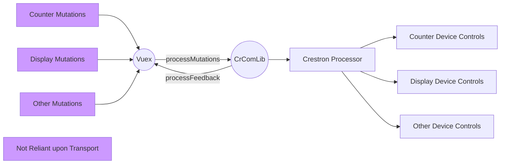

# crestron-vue-simpl-example

## Overview

This project, and it's sister project [crestron-vue-websocket-example](https://github.com/jeffderek/crestron-vue-websocket-example) are designed to demonstrate how to create a Vuex plugin for communication between a Crestron touchpanel and a Crestron processor without using CH5 elements.

These project are not intended to teach Vue or Vuex, nor are they intended to provide a ready-made framework for a full room system.

## Project Setup

1. UI
    1. Open the UI folder in Visual Studio Code
    2. In terminal, run `npm install`.
    3. Edit package.json to replace `test-tsw1070` in the `deploy` script with the hostname or address of your touchpanel
    4. Optionally follow the instructions [here](https://sdkcon78221.crestron.com/sdk/Crestron_HTML5UI/Content/Topics/UI-CH5-Archives.htm) to replace the `-p` flag in the `deploy` command with `-u` and `-i` after installing your SSH key on your touchpanel. This will prevent you from having to type your panel's username and password every time you deploy.
    5. Run the npm script `onestep:dev`. This will compile the project in development mode, package it as a .ch5z, transfer it to your touchpanel, and run the `projectload` command on the touchpanel to load the project.
    6. Point your touchpanel's IP Table at your control processor at IPID 0x03.
2. Code
    1. Open `CrestronVueExample.smw` in SIMPL Windows
    2. The project is currently compiled for an MC4, replace the control system with whatever your test system is.
    3. Compile and load the project to your system.

## Project Structure

Both projects use the exact same Vue frontend. All state is stored in Vuex. Each project uses a custom plugin for Vuex that subscribes to mutations, sends data back to the Crestron processor, parses responses from the processor, and mutates the state in Vuex. Individual pages or classes within Vue have absolutely no direct relationship with the communication method to the processor.

The most important thing to understand about this process is that the only communication with the processor happens via the plugin. [`crestron.js`](https://github.com/jeffderek/crestron-vue-simpl-example/blob/main/UI/src/store/plugins/crestron.js) is the main file for the plugin. It exports a function that is run by default as soon as Vuex is loaded.

In this project, that function checks to see if the project is loaded on a Crestron Touchscreen, and if it is then it subscribes to the online/offline state of the panel and sets up the [`processMutations.js`](https://github.com/jeffderek/crestron-vue-simpl-example/blob/main/UI/src/store/plugins/crestron/processMutation.js) and [`processFeedback.js`](https://github.com/jeffderek/crestron-vue-simpl-example/blob/main/UI/src/store/plugins/crestron/processFeedback.js) functions. Those functions use the Crestron CrComLib to communicate with the processor over traditional joins.

## Dependencies (and why they're included)

-   **Vue**
    -   Vue and it's associated dependencies, including Vuex and the Vue Router
    -   _vue_
    -   _vue-router_
    -   _vuex_
    -   _@vue/cli-plugin-router_
    -   _@vue/cli-plugin-vuex_
    -   _@vue/cli-service_
    -   _@vue/compiler-sfc_
-   **Sass**
    -   CSS Preprocessor
    -   _node-sass_
    -   _sass-loader_
-   **CrComLib**
    -   Crestron provided communication library that is used for system online/offline status and for using digital/analog/serial joins
    -   _@crestron/ch5-crcomlib_
-   **Eruda**
    -   On-screen console which lets you view the dev console directly on a touchscreen. Useful for debugging. Only initialized in development mode.
    -   _eruda_
-   **Lodash**
    -   Javascript utility library. Used in this project just for the debounce function which is used to debounce the system online/offline status.
    -   _lodash_

## Other Considerations

The translation between mutations and joins in this example is _very_ manual and tedious. For a large or complex system you will want to put a lot of thought into how to structure your joins and mutations to keep those files as straightforward as possible. If writing your backend in C# is possible, the [crestron-vue-websocket-example](https://github.com/jeffderek/crestron-vue-websocket-example) project may be a better option.
